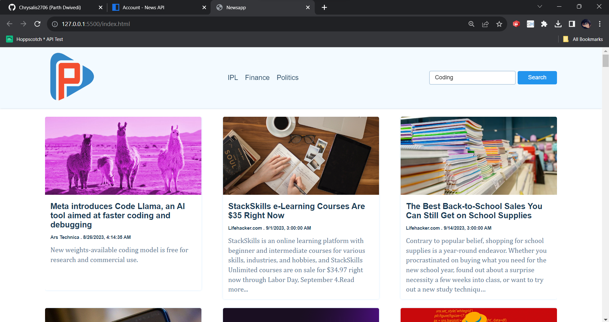

# NewsApp
Project Overview:

The News API Project with JavaScript is a dynamic web application that leverages the power of the News API to provide real-time news updates from various sources and categories. This project serves as a valuable tool for users to stay informed about current events, trending topics, and news articles of interest.

Project Description:

In today's fast-paced world, access to up-to-date news is essential. The News API Project was created to address this need by offering a user-friendly and feature-rich platform for accessing news articles from reputable sources. This project uses JavaScript to fetch data from the News API, display news articles, and provide a seamless user experience.

Key Features and Components:

API Integration: The project integrates with the News API, allowing it to retrieve the latest news articles, headlines, and details from various sources and categories.

News Categories: Users can choose from a range of news categories such as technology, business, health, sports, entertainment, and more. The project dynamically loads news articles based on the selected category.

Search Functionality: A search bar enables users to search for specific news articles or topics of interest. JavaScript is used to send search queries to the API and display the search results.

Article Display: The project presents news articles with detailed information, including headlines, publication dates, source names, and article descriptions. Each article is displayed in an organized and visually appealing manner.

Pagination: To manage large volumes of news articles, the project implements pagination, allowing users to navigate through multiple pages of results.

Responsive Design: The web application is designed to be responsive, ensuring that it works seamlessly on both desktop and mobile devices.

Error Handling: JavaScript is utilized for error handling, providing users with informative error messages in case of API request failures or other issues.

Loading Indicators: Loading indicators and animations are implemented to enhance the user experience while waiting for news articles to load.

Technologies Used:

JavaScript: The core programming language for fetching data from the News API, handling user interactions, and dynamic content rendering.
HTML and CSS: Used for structuring the web page and styling the user interface.
News API: An external API that provides access to a vast repository of news articles from different sources.
Project Benefits:

The News API Project with JavaScript offers several benefits:

Access to Current News: Users can easily access the latest news articles from various categories and sources, keeping them informed about global events and trends.

Customized News Experience: The ability to select news categories and search for specific topics allows users to tailor their news consumption according to their interests.

User-Friendly Interface: The project provides a user-friendly and intuitive interface for a seamless news reading experience.

Responsive Design: The web application is accessible on a wide range of devices, including smartphones, tablets, and desktop computers.

Real-Time Updates: News articles are updated in real-time, ensuring that users receive the most current information available.

The News API Project with JavaScript is a valuable tool for news enthusiasts and anyone seeking a convenient way to stay informed. It demonstrates the power of JavaScript in creating dynamic and interactive web applications that connect users with real-time information and news from around the world.
